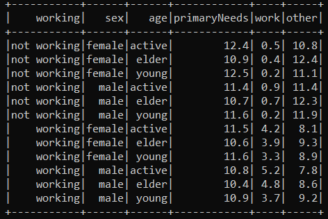

# Results
The Time Usage project successfully processed and summarized the American Time Use Survey (ATUS) dataset, providing insightful results into how different demographics allocate their time among primary needs, work, and other activities. 

The results are presented below:

Analysis of Results
The summarized data provides a comprehensive view of how employment status, gender, and age impact the distribution of time among primary needs, work, and leisure activities. 

Noteworthy observations include:

Working vs. Not Working: Those not working tend to allocate more time to primary needs and leisure activities compared to their working counterparts. Conversely, working individuals allocate a significant portion of their day to work-related activities.

Gender Differences: Within the same employment status and age category, differences in time allocation between males and females are observable, particularly in the amount of time dedicated to work.

Age Impact: Age categories reveal distinct patterns in how time is allocated, with younger individuals spending less time on work and more on leisure, and this trend reverses as age increases, especially noticeable in the working population.

These results offer valuable insights into the daily life patterns of different demographic groups, providing a foundation for further analysis and research into time use and its implications on lifestyle, work-life balance, and societal roles.
